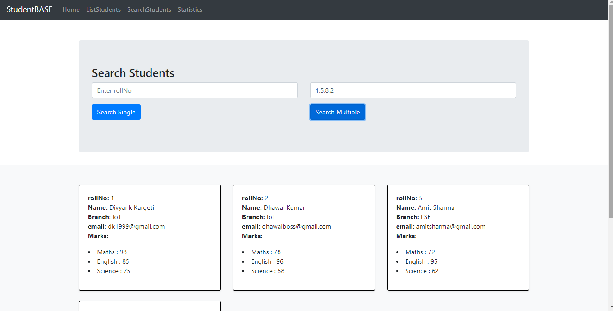

# MEAN-Stack-App-MongoDB-Express-AngularJS1.6-Node-

### Complete MEAN Stack Application developed using Bootstrap4, AngularJS 1.6.9, NodeJs, ExpressJs, MongoDB, Mongoose.

#### Home Page

#### AddStudents and ListStudents Page

#### SearchStudents Page (Search a single/particular student by rollNo OR Search multiple students by rollNo separated by commas)

#### Statistics Page
##### Statistics Page works on MongoDB Aggregation Framework

